# Books
tags : #📔Book 

```mermaid
graph LR
A[Books] --> B[개별 책] --> C[책 상세]
```



- 개별 책 파일 이름은 책 이름으로
	- 번역서라도 한글책 기준으로 작성
	- 부제목은 포함하지 않기
	- 제목에 `개정판` 등이 들어간 경우에도 제외
- 책 상세 파일이 필요한 경우, `책이름 - 챕터`로 표시
	- 각 챕터의 내용이 너무 많아 진다면 새로운 문서로 구분하기
	- 챕터의 경우 해당 챕터의 번호까지 같이 작성

# 독서 기록

## 상태별
```dataview
TABLE without id
	status as "상태",
	length(rows) as "책 수"
FROM #📔Book  
WHERE !contains(file.name, "Book")
GROUP BY status
SORT status DESC
```

# 책 목록
```dataview
TABLE without id
	status as "상태",
	file.link as "도서명",
	dateformat(start_read_date, "DD") as "시작일",
	dateformat(finish_read_date, "DD") as "완료일",
	rate as "내 평점"
FROM #📔Book  
WHERE !contains(file.name, "Book")
SORT start_read_date DESC
```