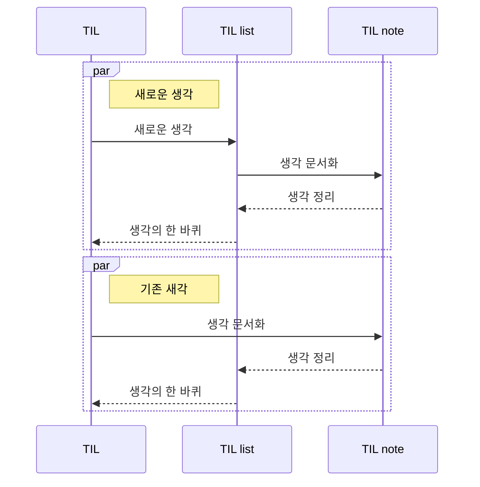
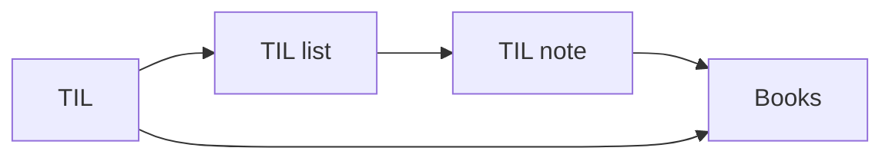

---
---

- links :
- tags : 

---

# Home

## TIL

- TIL Workflow

- 생각 정리 흐름

- 파일의 상하위 구조는 강제하지 않지만, 가상의 구조를 생성
- PKM은 TIL기준으로 작성됨
	- TIL에서 발생한 각 내용은 TIL list, TIL note를 따라 각 생각 문서화
	- 책과 함께 이루어진 경우 TIL에서 자연스럽게 이어지도록 작성

## 생각의 발생
> 모든 생각의 발생과 종료

- [[TIL]]

## 생각 관리
> 생각을 어떻게 구조화하고 정리할지

- MOC

### todo
- 생각 관리 문서 구조화
- 생각 관리 문서 사용방법 정의

## 생각 문서화
> 생각을 기록으로

- `notes`의 모든 기록

## 생각 정리
> 지금을 위한, 그리고 다음을 위한

- 다시 `notes/kanban detail`로 돌아가서 정리하기
	- 생각 정리하기 & 진행상태 수정하기
