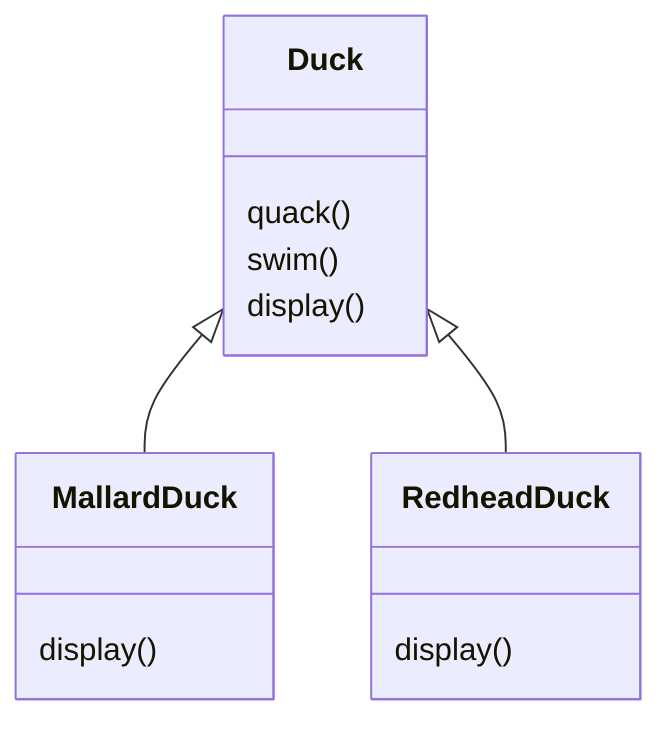
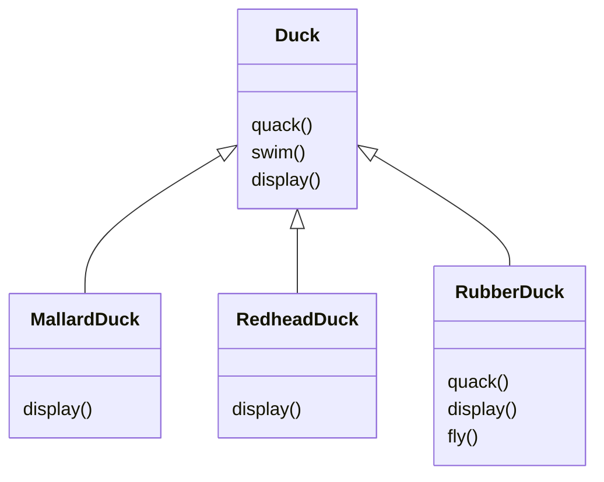

# [[Books]]
created : 2022-06-07 16:39
tags : #📔Book 

# 헤드퍼스트 디자인패터 Overview

## Chapter 00 들어가며, 이 책을 읽는 방법
- SimuDuck이라는 오리 시뮬레이션 게임, Duck 슈퍼클래스를 만들고 클래스를 확장해서 다른 종류의 오리 만듬

- `Duck` 클래스에 오리가 날 수 있는 `fly()`메서드 등을 추가하여 확장할 수 있음
	- 그런데 소리를 다르게 내고, 날지 않는 오리가 있다면?

- 기존 메서드들을 오버라이드해서 작성
	- 만약 더 다양한 오리가 생성되고, 계속 오버라이드를 해야한다면?
- 만약 오리의 각 동작을 상속을 받도록 지정하는 방식으로 수정한다면?

## Chapter 01 디자인 패턴 소개와 전략 패턴, 디자인 패터의 세계로 떠나기

## Chapter 02 옵저버 패턴, 객체들에게 연락 돌리기

## Chapter 03 데코레이터 패턴, 객체 꾸미기

## Chapter 04 팩토리 패턴, 객체지향 빵 굽기

## Chapter 05 싱글턴 패턴, 하나뿐인 객체 만들기

## Chapter 06 커맨드 패턴, 호출 갭슐화하기

## Chapter 07 어댑터 패턴과 퍼사드 패턴, 적응시키기

## Chapter 08 탬플릿 매소드 패턴, 알고리즘 캡슐화하기

## Chapter 09 반복자 패턴과 컴포지트 패턴, 컬렉션 잘 관리하기

## Chapter 10 상태 패턴, 객체의 상태 바꾸기

## Chapter 11 프록시 패턴, 객체 접근 제어하기

## Chapter 12 복합 패턴, 패턴을 모아 패턴 만들기

## Chapter 13 실전 디자인 패턴, 패턴과 행복하게 살아가기

## Chapter 14 기타 패턴, 다양한 패턴 빠르게 알아보기

# Conclusion
