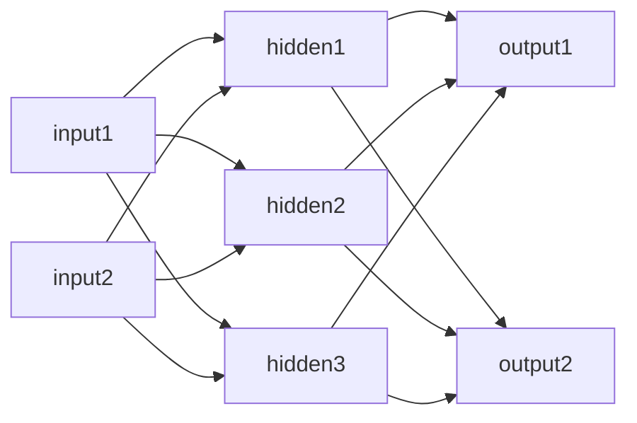
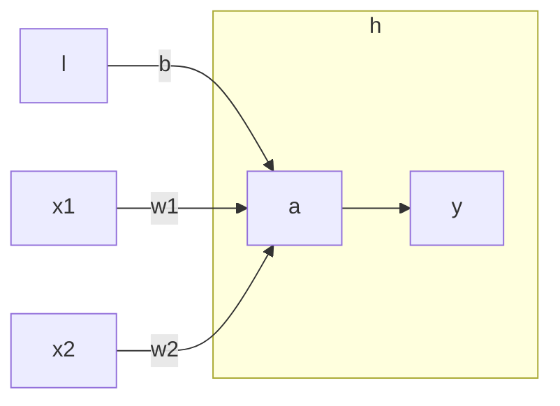

[[AI]]
created : 2022-04-24 17:33
tags : #🖥️Note/AI

# 신경망
- 신경망은 [[퍼셉트론]]과 매우 유사한 개념

- 퍼셉트론과 유사하게 입력에서 출력까지 연결되어 있음
- 일반적으로 가장 앞단의 입력층, 가장 뒷단의 출력층, 그 사이를 은닉층이라 부름
	- 은닉층은 실제로는 보이지 않음
	- 이 예시에서 은닉층이 1개이지만, 실제로는 그 이상이 될 수 있음

# [[활성화 함수]](activation function)
- 퍼셉트론이나 신경망에서 각 층을 연결하여 출력 신호를 변경하는 함수

- 예를 들어 $a = b + w_1 x_1 + w_2 x_2$, $y = h(a)$ 두개의 식이 있을 때,
- 입력층의 값에 $a = b + w_1 x_1 + w_2 x_2$ 식을 적용하고, 결과 값을 $y = h(a)$로 출력하는 것으로 표현할 수 있음
