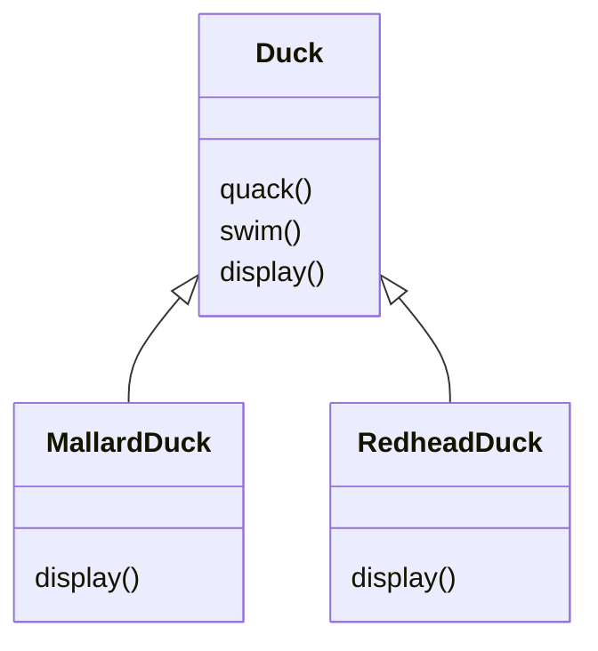
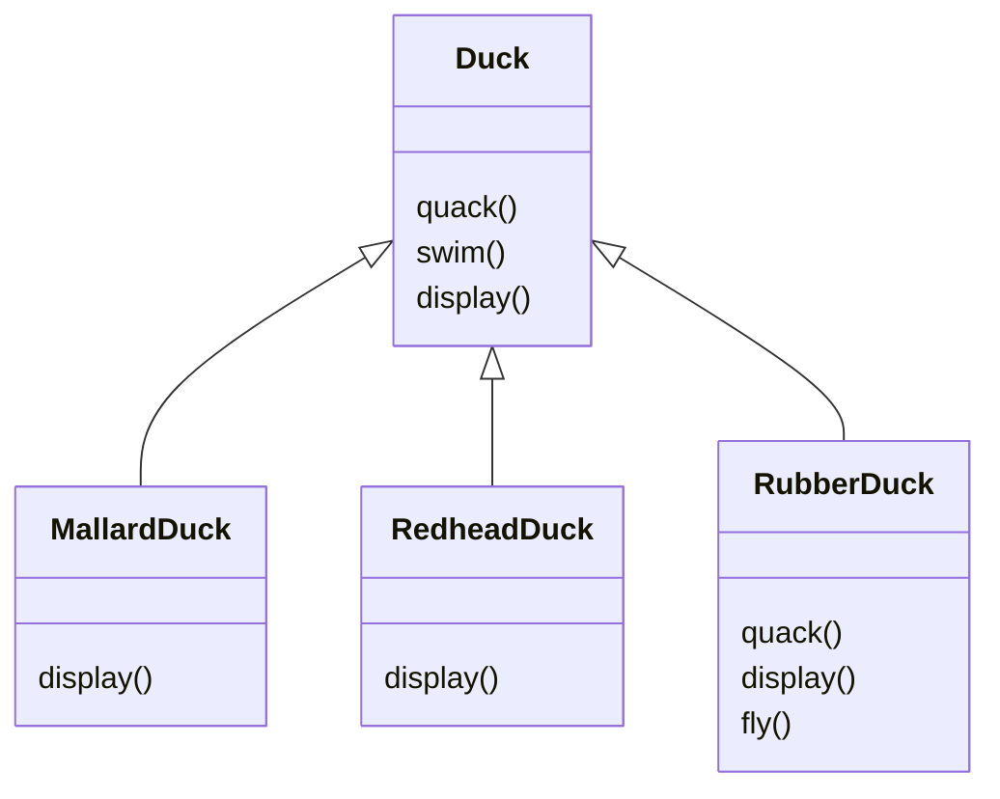
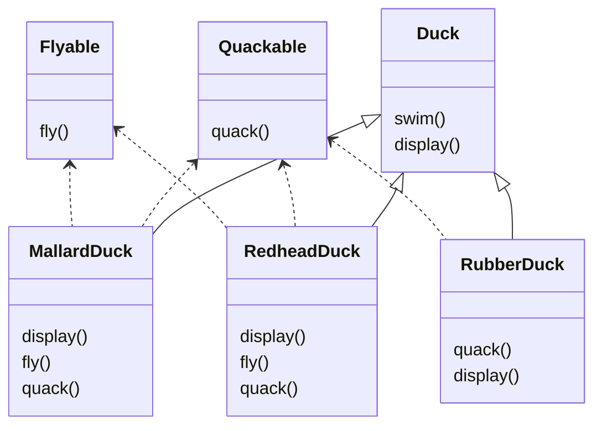
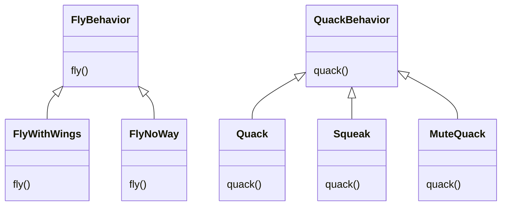
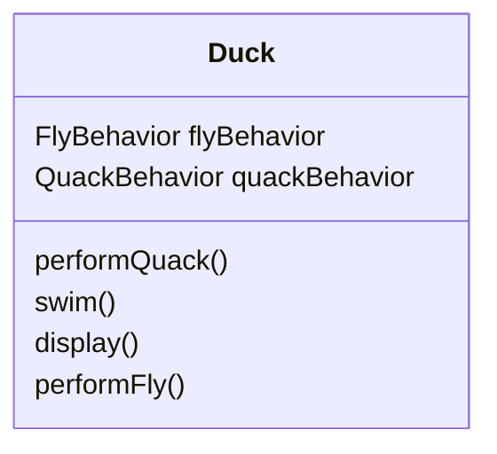

[[]]
created : 2022-06-13 05:01
tags : #🖥️

# 헤드퍼스트 디자인패턴 - chapter 00 들어가며
- SimuDuck이라는 오리 시뮬레이션 게임, Duck 슈퍼클래스를 만들고 클래스를 확장해서 다른 종류의 오리 만듬



- `Duck` 클래스에 오리가 날 수 있는 `fly()`메서드 등을 추가하여 확장할 수 있음
	- 그런데 소리를 다르게 내고, 날지 않는 오리가 있다면?



- 기존 메서드들을 오버라이드해서 작성
	- 만약 더 다양한 오리가 생성되고, 계속 오버라이드를 해야한다면?
- 만약 오리의 각 동작을 상속을 받도록 지정하는 방식으로 수정한다면?



- Qucakable, Flyable 클래스로 분류, 상황에 따라 오버라이드
- 더 편리하게 구현하기 위해, 코드 중복이 많아짐
- 상속으로 모든것을 해결할 수 없음
	- 서브클래스마다 행동이 바귀게 된다면, 올바르게 구현하지 못함
- **디자인 원칙** : 애플리케이션에서 달라지는 부분을 찾아내고, 달라지지 않는 부분과 분리
	- 바뀌는 부분은 따로 뽑아서 캡슐화, 바뀌지 않는 부분에는 영향을 미치지 않고 확장할 수 있음
	- Duck 클래스를 고려하면, fly(), quack() 부분을 제외하면 문제없이 작동

## 오리를 다시 디자인하기
- 오리의 행동 디자인
	- **디자인 원칙** :  구현보다는 인터페이스에 맞춰서 프로그래밍
- 오리의 행동을 Duck 클래스가 아니라 새로 구성한 행동 클래스에서 구현



- 오리가 나는 행동과, 우는 행동을 각각의 클래스로 구분하여 디자인하고, 각 행동 클래스를 통해 행동을 지정할 수 있음

## 오리행동 통합하기


- Duck 클래스에 flyBehavior, quackBehavior 인터페이스
	- 특정 구상 클래스 형식으로 선언하는 대신, 인스턴스 변수 추가

```java
public abstract class Duck {
	QuackBehavior quackBehavior
	// 기타 코드
	public void performQuack() {
		quackBehavior.quack()
	}
}
```

- 위를 기반으로 구현

```java
public class MallardDuck extends Duck {
	public MallardDuck() {
		quackBehavior = new Quack();
		flyBehavior = new FlyWithWings();
	}
	public void display() {
		System.out.println("저는 물오리입니다")
	}
}
```

- Duck 클래스를 상속받은 MallardDuck 클래스 생성

# Python code

