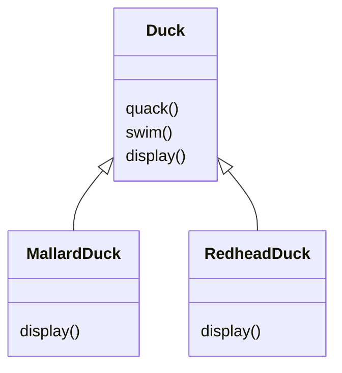
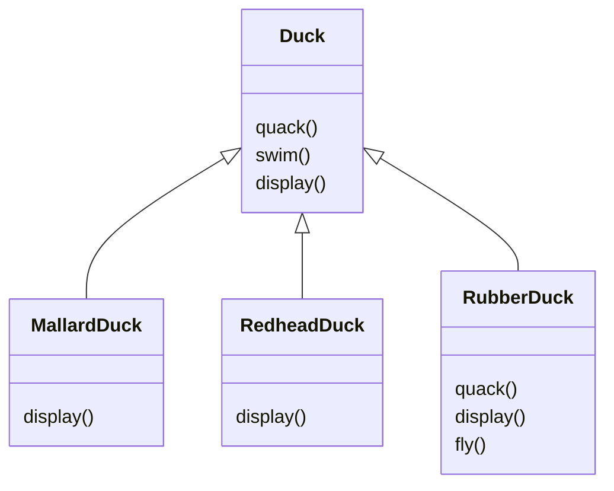
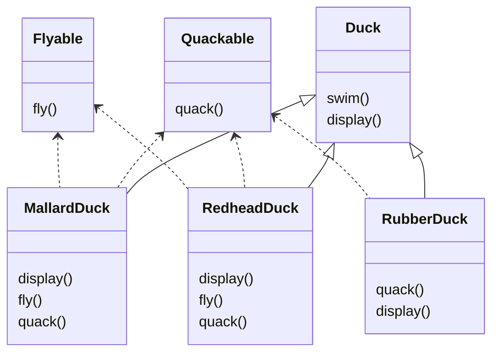
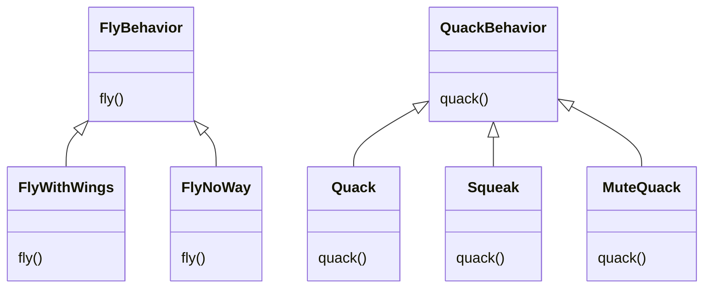
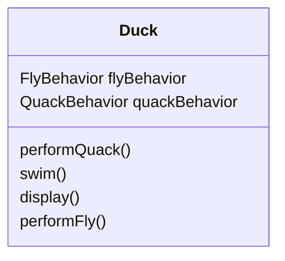
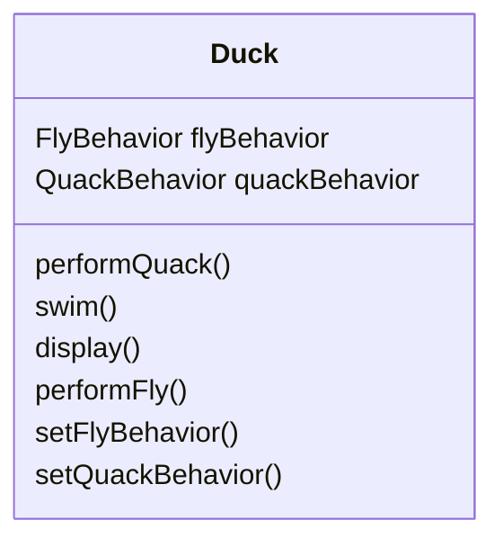
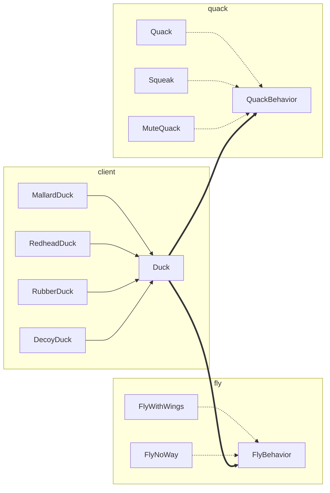
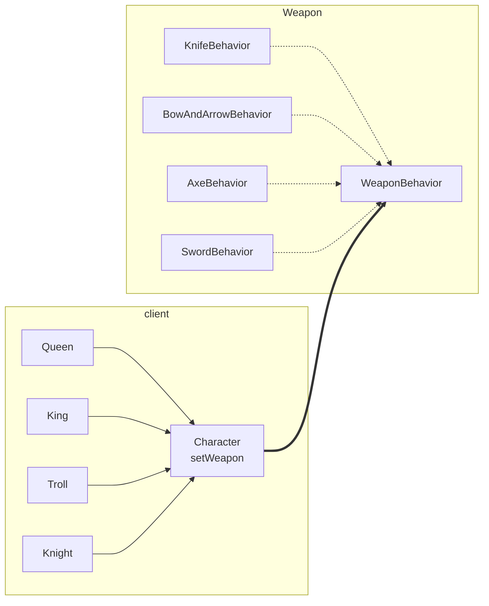

# 헤드퍼스트 디자인패턴 - chapter 01 디자인 패턴 소개와 전략 패턴

## 오리 시뮬레이션 게임, SimUduck

- SimuDuck이라는 오리 시뮬레이션 게임, Duck 슈퍼클래스를 만들고 클래스를 확장해서 다른 종류의 오리 만듬



- `Duck` 클래스에 오리가 날 수 있는 `fly()`메서드 등을 추가하여 확장할 수 있음
	- 그런데 소리를 다르게 내고, 날지 않는 오리가 있다면?



- 기존 메서드들을 오버라이드해서 작성
	- 만약 더 다양한 오리가 생성되고, 계속 오버라이드를 해야한다면?
- 만약 오리의 각 동작을 상속을 받도록 지정하는 방식으로 수정한다면?



- Qucakable, Flyable 클래스로 분류, 상황에 따라 오버라이드
- 더 편리하게 구현하기 위해, 코드 중복이 많아짐
- 상속으로 모든것을 해결할 수 없음
	- 서브클래스마다 행동이 바귀게 된다면, 올바르게 구현하지 못함
- **디자인 원칙** : 애플리케이션에서 달라지는 부분을 찾아내고, 달라지지 않는 부분과 분리
	- 바뀌는 부분은 따로 뽑아서 캡슐화, 바뀌지 않는 부분에는 영향을 미치지 않고 확장할 수 있음
	- Duck 클래스를 고려하면, fly(), quack() 부분을 제외하면 문제없이 작동

## 오리를 다시 디자인하기
- 오리의 행동 디자인
	- **디자인 원칙** :  구현보다는 인터페이스에 맞춰서 프로그래밍
- 오리의 행동을 Duck 클래스가 아니라 새로 구성한 행동 클래스에서 구현



- 오리가 나는 행동과, 우는 행동을 각각의 클래스로 구분하여 디자인하고, 각 행동 클래스를 통해 행동을 지정할 수 있음

## 오리행동 통합하기


- Duck 클래스에 flyBehavior, quackBehavior 인터페이스
	- 특정 구상 클래스 형식으로 선언하는 대신, 인스턴스 변수 추가

```java
public abstract class Duck {
	QuackBehavior quackBehavior
	// 기타 코드
	public void performQuack() {
		quackBehavior.quack()
	}
}
```

- 위를 기반으로 구현

```java
// MallardDuck.java
public class MallardDuck extends Duck {
	public MallardDuck() {
		quackBehavior = new Quack();
		flyBehavior = new FlyWithWings();
	}
	public void display() {
		System.out.println("저는 물오리입니다")
	}
}
```

- Duck 클래스를 상속받은 MallardDuck 클래스 생성

## 오리 코드 테스트

```java
// Duck.java
public abstract class Duck {
	FlyBehavior flyBehavior;
	QuackBehavior quackBehavior;

	public Duck() {}
	public abstract void display();
	public void performFly() {
		flyBehavior.fly();
	}
	public void performQuack() {
		quackBehavior.quack();
	}
	public void swim() {
		System.out.println("모든 오리는 물에 뜹니다. 가짜 오리도 뜨죠");
	}
}

public interface FlyBehavior {
	public void fly();
}

public interface QuackBehavior {
	public void quack();
}

// FlyWithWings.java
public class FlyWithWings implements FlyBehavior {
	public void fly() {
		System.out.println("날고 있어요!!");
	}
}

// FlyNoWay.java
public class FlyNoWay implements FlyBehavior {
	public void fly() {
		System.out.println("저는 못 날아요");
	}
}

// Quack.java
public class Quack implements QuackBehavior {
	public void quack() {
		Systme.out.println("꽥");
	}
}

// MuteQuack.java
public class MuteQuack implements QuackBehavior {
	public void quack() {
		System.out.println("<<조용~>>");
	}
}

// Squeak.java
public class Squeak implements QuackBehavior {
	public void queack() {
		System.out.println("삑");
	}
}
```

```java
public class MiniDuckSimulator {
	public static void main(String[] args) {
		Duck mallard = new MallardDuck();
		mallard.performQuack();
		mallard.performFly();
	}
}
```

## 동적으로 행동 지정하기
- 동적으로 만든 행동을 활용하기
- 오리 행동 형식을 생성자에서 인스턴스를 만드는 것이 아닌 Duck의 서브클래스에서 세터 메소드(setter method)를 호출하는 방법?

```java
public void setFlyBehavior(FlyBehavior fb) {
	flyBehavior = fb;
}

public void setQuackBehavior(QuackBehavior qb) {
	quackBehavior = qb;
}
```



- Duck 클래스에 메소드 2개 추가
	- 이 두 메소드를 호출하면 언제든지 행동을 즉석으로 바꿀 수 있음

```java
// ModelDuck.java
public class ModelDuck extends Duck {
	public ModelDuck() {
		flyBehavior = new FlyNoWay();
		quackBehavior = new Quack();
	}

	public void display() {
		System.out.println("저는 모형 오리입니다");
	}
}
```

```java
// FlyRocketPowered.java
public class FlyRocketPowered implements FlyBehavior {
	public void fly() {
		Systme.out.println("로켓 추진으로 날아갑니다");
	}
}
```

```java
// MiniDuckSimulator.java
public class MiniDuckSimulator {
	public static void main(String[] args) {
		Duck mallard = new MallardDuck();
		mallard.performQuack();
		mallard.perfomrFly();

		// 코드 추가
		Duck model = new ModelDuck();
		model.performFly();
		model.setFlyBehavior(new FlyRockerPowered());
		model.perfomrFly();
	}
}
```

- `ModelDuck`을 추가하고, 로켓 추진 기능 부여
	- `PerformFly()`를 처음 호출하면 기본 메소드인 `FlyNoWay()`가 호출
	- 이후 `setFlyBehavior()`를 통하여 로켓 추진 부여



- 오리의 행동들을 일련의 행동으로 생각하는 대신, 알고리즘군(family of algorithms)으로 생각
- 클래스 사이 관계도 고민하기
	- 클래스 사이가 어떤 관계인지, A는 B이다, A에는 B가 있다, A가 B를 구현한다 등…
- A에는 B가 있다 관계
	- 각 오리에 FlyBehavior, QuackBehavior가 있음
	- 이런 방식으로 두 클래스를 합치는 것을 `구성`을 이용한다고 부름
	- 오르 클래스에서 행동을 상속받는 대신, 올바른 행동 객체로 구성되어 행동을 부여 받음
- **디자인 원칙** : 상속보다는 구성을 활용한다

> [!note] 전략 패턴(Strategy Pattern)
> 알고리즘군을 정의하고 캡슐화해서 각각의 알고리즘 군을 수정해서 쓸 수 있게 해줌
> 전략 패턴을 사용하면 클라이언트로부터 알고리즘을 분리해서 독립적으로 변경할 수 있음

## 디자인 패턴 퍼즐


